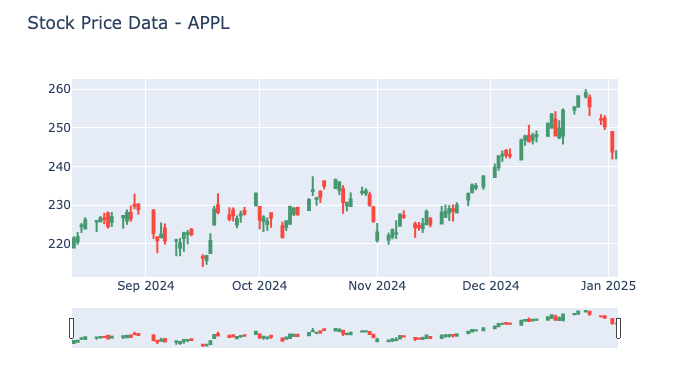

# Data Engineering Basics

First steps in extracting data from an api and build a simple data pipeline from raw to cleaned.



## My Learnings:

- How to structure a Project for ETL with python
- Python in Jupyter Notebooks
- venv with pipenv and requirements.txt
- usage of an api with requests
- data transformation from dict to polars Dataframe
- saving data in different formats like csv and parquet
- using git reset with --soft and --hard flags to undo commit to remove secrets (.env and .gitignore)
- responsively plot stock data with plotly (candlestick)


# Prerequisites

- python v3.13
Docker-Desktop needs to be installed on your machine.

## Installation

Clone the repository:
```bash
git clone https://github.com/Simo-Z/webserver-container.git
cd webserver-container
```
Explore the jupyter Notebooks

## License

MIT License

Copyright (c) [2025] [Simo Zilling]

Permission is hereby granted, free of charge, to any person obtaining a copy of this software and associated documentation files (the "Software"), to deal in the Software without restriction, including without limitation the rights to use, copy, modify, merge, publish, distribute, sublicense, and/or sell copies of the Software, and to permit persons to whom the Software is furnished to do so, subject to the following conditions:

The above copyright notice and this permission notice shall be included in all copies or substantial portions of the Software.

THE SOFTWARE IS PROVIDED "AS IS", WITHOUT WARRANTY OF ANY KIND, EXPRESS OR IMPLIED, INCLUDING BUT NOT LIMITED TO THE WARRANTIES OF MERCHANTABILITY, FITNESS FOR A PARTICULAR PURPOSE, AND NONINFRINGEMENT. IN NO EVENT SHALL THE AUTHORS OR COPYRIGHT HOLDERS BE LIABLE FOR ANY CLAIM, DAMAGES, OR OTHER LIABILITY, WHETHER IN AN ACTION OF CONTRACT, TORT, OR OTHERWISE, ARISING FROM, OUT OF, OR IN CONNECTION WITH THE SOFTWARE OR THE USE OR OTHER DEALINGS IN THE SOFTWARE.